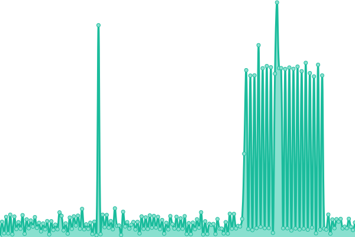

# [📈 Live Status](https://status.ano404.top): <!--live status--> **🟧 糟糕，部分系统宕机中……**

This repository contains the open-source uptime monitor and status page for [RainThings](rainthings.ml), powered by [Upptime](https://github.com/upptime/upptime).

With [Upptime](https://upptime.js.org), you can get your own unlimited and free uptime monitor and status page, powered entirely by a GitHub repository. We use [Issues](https://github.com/RainThings/uptime/issues) as incident reports, [Actions](https://github.com/RainThings/uptime/actions) as uptime monitors, and [Pages](https://status.ano404.top) for the status page.

<!--start: status pages-->
<!-- This summary is generated by Upptime (https://github.com/upptime/upptime) -->
<!-- Do not edit this manually, your changes will be overwritten -->
<!-- prettier-ignore -->
| URL | 状态 | 历史 | 响应时间 | 可用率 |
| --- | ------ | ------- | ------------- | ------ |
|  RSOS服务控制面板 | 正常 | [rsos.yml](https://github.com/RainThings/uptime/commits/HEAD/history/rsos.yml) | 

 623ms
     
 | 

<a href="https://status.ano404.top/history/rsos">100.00%</a>
    

|  HK区服 | 离线 | [hk.yml](https://github.com/RainThings/uptime/commits/HEAD/history/hk.yml) | 

 1877ms
     
 | 

<a href="https://status.ano404.top/history/hk">76.64%</a>
    

|  US区服 | 正常 | [us.yml](https://github.com/RainThings/uptime/commits/HEAD/history/us.yml) | 

 732ms
     
 | 

<a href="https://status.ano404.top/history/us">100.00%</a>
    

|  RU区服 | 正常 | [ru.yml](https://github.com/RainThings/uptime/commits/HEAD/history/ru.yml) | 

 1961ms
     
 | 

<a href="https://status.ano404.top/history/ru">100.00%</a>
    

<!--end: status pages-->

[**Visit our status website →**](https://status.ano404.top)

## 📄 License

- Powered by: [Upptime](https://github.com/upptime/upptime)
- Code: [MIT](./LICENSE) © [RainThings](rainthings.ml)
- Data in the `./history` directory: [Open Database License](https://opendatacommons.org/licenses/odbl/1-0/)
