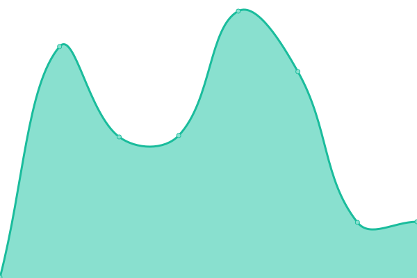

# [📈 Live Status](https://status.ano404.top): <!--live status--> **🟩 All systems operational**

This repository contains the open-source uptime monitor and status page for [RainThings](rainthings.ml), powered by [Upptime](https://github.com/upptime/upptime).

With [Upptime](https://upptime.js.org), you can get your own unlimited and free uptime monitor and status page, powered entirely by a GitHub repository. We use [Issues](https://github.com/RainThings/uptime/issues) as incident reports, [Actions](https://github.com/RainThings/uptime/actions) as uptime monitors, and [Pages](https://status.ano404.top) for the status page.

<!--start: status pages-->
<!-- This summary is generated by Upptime (https://github.com/upptime/upptime) -->
<!-- Do not edit this manually, your changes will be overwritten -->
<!-- prettier-ignore -->
| URL | Status | History | Response Time | Uptime |
| --- | ------ | ------- | ------------- | ------ |
|  [RSOS服务控制面板](https://cdnus.ano404.top) | 🟩 Up | [rsos.yml](https://github.com/RainThings/uptime/commits/HEAD/history/rsos.yml) | 

 235ms
     
 | 

<a href="https://status.ano404.top/history/rsos">100.00%</a>
    

|  [HK区服](https://hk.ano404.top:2087) | 🟩 Up | [hk.yml](https://github.com/RainThings/uptime/commits/HEAD/history/hk.yml) | 

 1357ms
     
 | 

<a href="https://status.ano404.top/history/hk">100.00%</a>
    

|  [US区服](https://cdnus.ano404.top:2087) | 🟩 Up | [us.yml](https://github.com/RainThings/uptime/commits/HEAD/history/us.yml) | 

 233ms
     
 | 

<a href="https://status.ano404.top/history/us">100.00%</a>
    

|  [RU区服](https://link.ano404.top:2087) | 🟩 Up | [ru.yml](https://github.com/RainThings/uptime/commits/HEAD/history/ru.yml) | 

 1820ms
     
 | 

<a href="https://status.ano404.top/history/ru">100.00%</a>
    

<!--end: status pages-->

[**Visit our status website →**](https://status.ano404.top)

## 📄 License

- Powered by: [Upptime](https://github.com/upptime/upptime)
- Code: [MIT](./LICENSE) © [RainThings](rainthings.ml)
- Data in the `./history` directory: [Open Database License](https://opendatacommons.org/licenses/odbl/1-0/)
